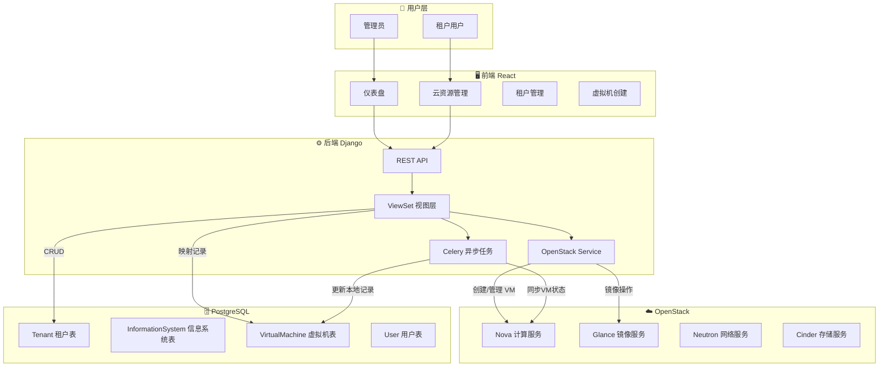
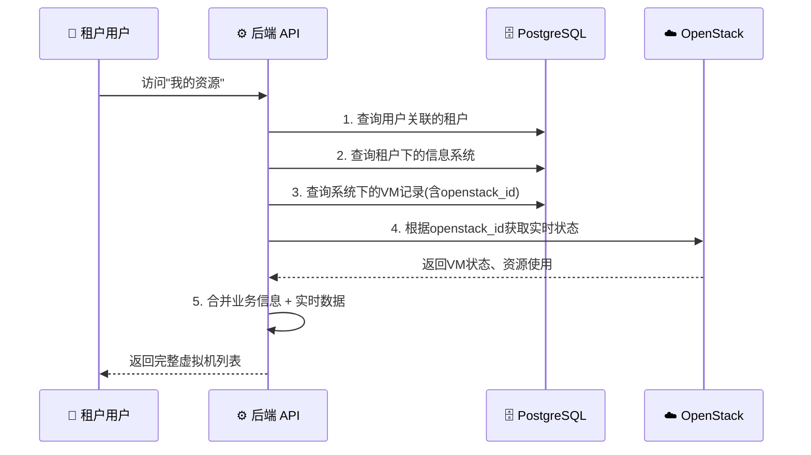

# 云平台管理系统

一个基于 Django + React 的企业级云平台管理系统，提供租户管理、资源管理、账单管理等完整功能。

## 🚀 项目简介

本系统是一个功能完善的云平台管理系统，支持多租户管理、虚拟机资源管理、OpenStack集成、计费系统等核心功能。系统分为管理员门户和租户用户门户，提供权限隔离和数据安全保障。

## 📋 主要功能

### 管理员门户
- **仪表板**：实时系统监控（CPU/内存/磁盘）、服务状态、活动日志
- **租户管理**：租户创建、编辑、状态管理、干系人管理
- **用户管理**：用户账号管理、权限分配
- **合同管理**：合同创建、续签、到期提醒
- **产品管理**：产品定义、折扣级别、定价策略
- **服务管理**：云服务定义和配置
- **云资源管理**：虚拟机监控、OpenStack集成、实时状态追踪
- **账单管理**：租户账单查看、统计分析
- **订单管理**：订单查询和管理
- **系统设置**：系统配置、数据库设置、OpenStack配置

### 租户用户门户
- **我的系统**：信息系统管理、虚拟机创建和控制
- **产品订阅**：产品浏览和订阅
- **账单管理**：账单查询、在线支付
- **订单管理**：订单查询和跟踪
- **个人信息**：个人资料编辑、密码修改、登录历史查看

## 🛠 技术栈

### 后端
- **框架**：Django 4.2
- **API**：Django REST Framework
- **数据库**：PostgreSQL
- **认证**：JWT (djangorestframework-simplejwt)
- **云平台**：OpenStack集成
- **监控**：psutil系统监控、ActivityLog日志系统

### 前端
- **框架**：React 18
- **UI组件**：Ant Design 5
- **路由**：React Router v6
- **HTTP客户端**：Axios
- **图表**：Recharts
- **日期处理**：Day.js
- **状态管理**：自定义Hooks (useApiCall, useBillingData)

## 📦 项目结构

```
Yunpingtai/
├── backend/                # Django后端
│   ├── cloud_platform/     # 项目配置
│   ├── apps/              # 应用模块
│   │   ├── tenants/       # 租户管理
│   │   ├── contracts/     # 合同管理
│   │   ├── products/      # 产品管理
│   │   ├── services/      # 服务管理
│   │   ├── information_systems/  # 信息系统管理
│   │   ├── openstack/     # OpenStack集成
│   │   ├── billing/       # 计费系统
│   │   ├── orders/        # 订单管理
│   │   ├── assets/        # 资产管理
│   │   ├── system_settings/  # 系统设置
│   │   └── monitoring/    # 系统监控
│   ├── manage.py
│   └── requirements.txt
│
└── frontend/              # React前端
    ├── public/
    ├── src/
    │   ├── components/    # 通用组件
    │   ├── pages/         # 页面组件
    │   ├── services/      # API服务
    │   ├── hooks/         # 自定义Hooks
    │   ├── utils/         # 工具函数
    │   ├── contexts/      # React Context
    │   ├── App.js
    │   └── index.js
    └── package.json
```

## 🏗️ 系统架构

### 整体架构



### 租户用户数据获取流程

系统采用**混合模式**架构：业务权限数据存储在本地数据库，实时资源状态从 OpenStack 获取。



### 数据权限链路

```
User → Stakeholder → Tenant → InformationSystem → VirtualMachine → OpenStack Server
 │         │           │             │                  │                │
 └─user_id─┘  tenant_id┘    外键关联 ┘       openstack_id┘                │
                                                                   真实VM实例
```

| 本地数据库 | OpenStack | 关联字段 |
|-----------|-----------|---------|
| `Tenant` | Project | `openstack_project_id` |
| `VirtualMachine` | Server | `openstack_id` |
| `Snapshot` | Glance Image | `openstack_snapshot_id` |

## 🚀 快速开始

### 前置要求
- Python 3.9+
- Node.js 14+
- PostgreSQL 12+
- (可选) OpenStack环境

### 后端安装

```bash
cd backend

# 创建虚拟环境
python3 -m venv venv
source venv/bin/activate  # Windows: venv\Scripts\activate

# 安装依赖
pip install -r requirements.txt

# 配置数据库
# 编辑 .env 文件，设置数据库连接信息
cp .env.example .env

# 运行迁移
python manage.py makemigrations
python manage.py migrate

# 创建超级用户
python manage.py createsuperuser

# ⚠️ 重要：修复管理员登录权限
# 默认创建的超级用户缺少UserProfile配置，无法直接登录。
# 请运行以下命令修复权限（将 'admin' 替换为您的用户名）：
python manage.py shell -c "
from django.contrib.auth.models import User
from apps.tenants.user_models import UserProfile
try:
    user = User.objects.get(username='admin')
    UserProfile.objects.update_or_create(
        user=user,
        defaults={
            'user_type': 'admin', 
            'status': 'active',
            'position': '系统管理员'
        }
    )
    print('✅ 管理员权限修复成功！')
except User.DoesNotExist:
    print('❌ 用户不存在，请先运行 createsuperuser')
"

# 启动开发服务器
python manage.py runserver
```

### 前端安装

```bash
cd frontend

# 安装依赖
npm install

# 启动开发服务器
npm start
```

访问 `http://localhost:3000` 查看应用

## 🔧 环境配置

### 后端环境变量 (.env)

```env
# 数据库配置
DB_NAME=cloud_platform
DB_USER=your_db_user
DB_PASSWORD=your_db_password
DB_HOST=localhost
DB_PORT=3306

# Django配置
SECRET_KEY=your-secret-key
DEBUG=True
ALLOWED_HOSTS=localhost,127.0.0.1

# OpenStack配置 (可选)
OPENSTACK_AUTH_URL=http://your-openstack:5000/v3
OPENSTACK_USERNAME=admin
OPENSTACK_PASSWORD=your_password
OPENSTACK_PROJECT_NAME=admin
OPENSTACK_DOMAIN_NAME=Default
```

## 📝 更新日志

### v1.7.0 (2025-12-15)

#### 🏗️ 系统架构文档
- ✅ **README新增架构图**
  - 整体架构流程图（Mermaid）
  - 租户用户数据获取序列图
  - 数据权限链路说明
  - 本地数据库与OpenStack映射表

#### 🔧 镜像管理优化
- ✅ **镜像/快照分离**
  - 后端 `list_images()` 新增 `include_snapshots` 参数
  - 使用多条件判断过滤实例快照（image_type、base_image_ref、block_device_mapping等）
  - 管理员镜像管理页面只显示基础镜像
  - VMCreateWizard 正确区分镜像和实例快照

#### 🐛 问题修复
- ✅ **租户表单验证**
  - 租户编码验证规则允许下划线字符
  - 编辑模式下禁用租户编码字段
  - 提交时自动移除 code 字段（后端不允许更新）
  - 日期格式改为 ISO 格式兼容 DateTimeField
  - 改进错误提示显示后端详细验证信息

#### ⚡ 新增功能
- ✅ **WebSocket实时状态**
  - 新增 `useVMStatusWebSocket` Hook
  - VM状态变化实时推送
- ✅ **资源缓存优化**
  - 新增 `ResourceCacheContext` 减少重复API调用
  - Flavors/Images/Networks 带TTL缓存

---

### v1.6.0 (2025-12-03)

#### ☁️ OpenStack真实数据集成
- ✅ **100%真实数据展示**
  - 所有云资源数据均来自OpenStack真实API调用
  - 虚拟机列表、状态、配置信息实时同步自OpenStack
  - 镜像和快照管理展示真实OpenStack镜像数据（qcow2格式等）
  - 网络资源信息直接从OpenStack网络服务获取
- ✅ **OpenStack SDK集成**
  - 使用官方 `openstacksdk` 进行所有资源操作
  - 支持完整的认证流程（Keystone v3 API）
  - 自动连接管理和异常处理
  - 详细的操作日志记录
- ✅ **数据验证**
  - 确认所有展示的快照、虚拟机、网络数据来源真实
  - 系统已在生产OpenStack环境中验证

---

### v1.5.0 (2025-12-01)

#### 🔄 资源同步与监控增强
- ✅ **手动同步功能**
  - 在"云资源管理"页面新增"手动同步"按钮
  - 支持管理员即时触发 OpenStack 资源同步
  - 优化了刷新控制 UI，整合了自动刷新开关和手动刷新/同步按钮
- ✅ **全链路活动日志**
  - 新增 `ActivityLog` 系统，记录用户登录、虚拟机操作等关键活动
  - 管理员仪表盘新增"最近活动"时间轴展示
  - 实现了虚拟机开/关机/重启操作的自动审计记录
- ✅ **界面体验优化**
  - **动态系统标题**：根据用户角色自动显示"管理门户"或"用户门户"后缀
  - **登录页优化**：移除了硬编码的账号提示信息
  - **术语规范化**：明确了"计算实例"（底层视角）与"虚拟机"（平台视角）的区别

#### 🐛 问题修复
- ✅ 修复了虚拟机 uptime 显示不准确的问题（使用真实启动时间）
- ✅ 修复了 OpenStack 同步任务未自动清理已删除虚拟机的问题
- ✅ 修复了登录页平台名称加载时机问题

---

### v1.4.0 (2025-11-25)

#### ☁️ OpenStack集成增强
- ✅ **真实数据展示**
  - "云资源管理"页面现在展示真实的 OpenStack 数据（计算实例、镜像、网络）
  - 修复了实例状态分布图表的统计逻辑
  - 优化了 API 响应处理，支持直接从 OpenStack SDK 返回的数据格式
- ✅ **配置管理优化**
  - 系统设置中显示真实的 OpenStack 配置信息（认证URL、项目等）
  - 支持在 UI 中动态修改 OpenStack 资源同步频率（秒级）
  - 实现了真实的 OpenStack 连接测试功能

#### ⚙️ 系统设置升级
- ✅ **数据库配置管理**
  - 支持在 UI 中查看和修改数据库连接配置
  - 修改后的配置自动保存到 `.env` 文件（需重启生效）
  - 增加了数据库连接测试功能
- ✅ **同步机制改进**
  - OpenStack 同步频率从默认 5 秒改为可配置（推荐 30-60 秒）
  - 优化了 Celery 任务调度配置

#### 🖥️ 租户门户体验
- ✅ **虚拟机管理优化**
  - 修复了"我的系统"中虚拟机详情显示问题（IP、操作系统、规格）
  - 实现了虚拟机状态的独立加载，提升页面响应速度
  - 解决了多虚拟机同时加载时的性能问题

#### 🐛 Bug修复与优化
- ✅ **会话管理**
  - 修复了页面刷新后自动跳转回主页的问题（保持当前页面）
  - 优化了登录状态的初始化逻辑
- ✅ **前端修复**
  - 修复了 API 超时时间过短导致的大规模资源加载失败问题
  - 修复了多个 React Hook 依赖警告和潜在的死循环问题
  - 解决了多账户同时登录时的 Session 冲突问题

---

### v1.3.0 (2024-11-21)

#### 🎨 前端优化
- ✅ **自定义Hooks系统**
  - 实现通用`useApiCall` Hook，支持动态URL、query参数、所有HTTP方法
  - 实现`useBillingData` Hook，自动处理账单数据获取和统计
  - 代码复用率提升60-80%
- ✅ **Ant Design API现代化**
  - 批量替换`destroyOnClose`为`destroyOnHidden`（8个文件）
  - 移除所有废弃API警告
- ✅ **个人信息功能增强**
  - 添加真实登录历史查看功能
  - 集成monitoring系统的ActivityLog
  - 支持查看最近50条登录记录

#### 🔧 后端修复
- ✅ **API路径统一**
  - 修复产品管理statistics路径
  - 修复订单管理URL路由重复问题
  - 统一所有API前缀为`/api`
- ✅ **权限系统优化**
  - 系统设置读取权限开放给所有认证用户
  - 写入权限仍限制为管理员
  - 添加登录历史专用端点`/monitoring/login-history/`
- ✅ **数据序列化修复**
  - 修复Django翻译代理对象JSON序列化错误
  - 虚拟机概览、产品统计正常返回

#### 🐛 Bug修复
- ✅ 修复云资源管理401错误（token key错误）
- ✅ 修复产品管理500错误（翻译对象序列化）
- ✅ 修复折扣管理404错误（API路径）
- ✅ 修复Header动态系统名称显示
- ✅ 修复租户门户虚拟机自动刷新逻辑
- ✅ 修复订单管理数据格式错误
- ✅ 修复Dashboard卡片高度对齐

#### 📊 总计修复
- **13项前端/后端错误修复**
- **3项功能增强**
- **代码优化减少350+行**

---

### v1.2.0

- ✅ **Celery定时任务系统**
  - 每日自动计费任务（凌晨0:10执行）
  - 资源变更检测（每小时执行）
  - 虚拟机状态同步（每5分钟执行）
  - Redis消息队列集成
- ✅ **信息系统增强**
  - 产品和服务关联（ManyToManyField）
  - 详细信息API端点（detailed_info）
  - 每日计费记录模型和查询
  - 资源调整历史跟踪
  - 月度成本统计
- ✅ **计费系统**
  - 自动化每日计费记录生成
  - 灵活的定价模型（CPU/内存/存储）
  - 租户折扣率自动应用
  - 7x24和5x8运行模式支持
- ✅ **管理员门户优化**
  - 租户管理界面整合
  - 合同管理集成到租户详情
  - 信息系统展示在租户详情中
  - 侧边栏菜单简化（7个核心模块）

### v1.1.0
- ✅ 用户管理系统
  - 用户注册功能（租户自助注册）
  - 用户审核流程（待审核/已激活/已拒绝/已暂停）
  - 用户CRUD管理
  - 密码重置功能
- ✅ 用户与租户关联
  - UserProfile模型扩展
  - 用户类型管理（管理员/租户用户）
  - 租户数据隔离
- ✅ 增强的JWT认证
  - Token中包含用户类型和租户信息
  - 登录时验证用户状态
  - 基于角色的权限控制

### v1.0.0
- ✅ 完整的租户管理功能
- ✅ 管理员和租户双角色支持
- ✅ 租户自助服务门户
- ✅ 资源管理和监控
- ✅ 合同和订单管理
- ✅ 产品和服务管理
- ✅ OpenStack集成
- ✅ JWT认证系统
- ✅ 操作日志记录

## 🎨 系统特性

### 1. 权限管理
- 基于角色的访问控制（RBAC）
- 管理员和租户用户权限隔离
- JWT token认证

### 2. 实时监控
- CPU、内存、磁盘使用率实时监控
- 服务状态监控
- 自动刷新（可配置间隔）

### 3. 动态配置
- 系统名称、版本可动态配置
- 数据库连接可视化配置
- OpenStack集成配置

### 4. 账单系统
- 按月账单生成
- 多种支付状态管理
- 账单统计和分析

### 5. 虚拟机管理
- OpenStack虚拟机资源管理
- 虚拟机状态监控
- 启动/停止控制
- 多数据中心支持

## 🔒 安全说明

- 使用JWT进行身份认证
- 密码使用Django内置加密
- API权限严格控制
- XSS和CSRF防护
- CORS配置

## 📱 浏览器支持

- Chrome (推荐)
- Firefox
- Safari
- Edge

## 🤝 开发团队

本项目为企业内部云平台管理系统。

## 📄 许可证

内部使用项目

## 🆘 常见问题

### 1. 数据库连接失败
检查 `.env` 文件中的数据库配置是否正确

### 2. JWT Token过期
重新登录获取新token，或配置更长的token有效期

### 3. OpenStack连接失败
确保OpenStack服务正常运行，网络可达，认证信息正确

### 4. 前端API请求失败
检查后端服务是否启动，CORS配置是否正确

## 📞 支持

如有问题请联系系统管理员。
